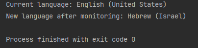

# Keyboard Layout Change Monitor

## Description

This Python script monitors changes to a specific registry key related to input locales on Windows. It detects when the keyboard language layout is changed and logs the current keyboard layout language of the foreground window before and after the monitoring.

The script sets up a registry change notification on the following registry key:
SOFTWARE\WOW6432Node\Microsoft\Input\Locales

It utilizes Windows API functions via `ctypes` to interact with the registry and handle system events.

## Features

- Monitors registry key changes related to input locales.
- Logs the current keyboard layout language.
- Provides real-time updates when a keyboard language change is detected.

## Requirements

- Python 3.12 or later
- Windows OS

## Code Explanation

- **Registry Monitoring**: The script uses Windows API functions to monitor the registry key for changes.
- **Language Detection**: It retrieves the current keyboard layout language of the foreground window.
- **Logging**: The script logs changes and provides feedback on registry key modifications.

## Contribution

If you would like to contribute to this project, please fork the repository and submit a pull request with your changes. Ensure that your code adheres to the project's coding standards and includes relevant tests.

## License

This project is licensed under the MIT License. See the [LICENSE](LICENSE) file for more details.

## Example img

